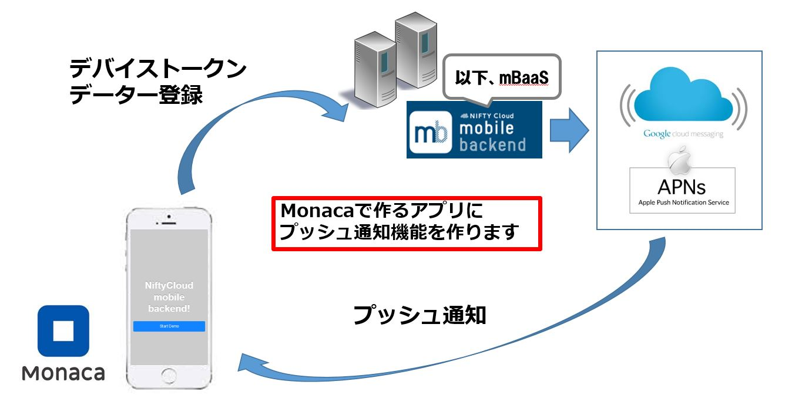
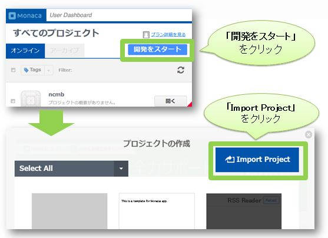
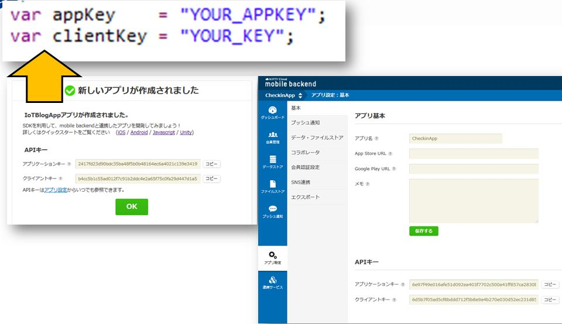

# Monaca x NIFTY Cloud mobile backend プッシュ通知サンプル

===

# Overview

Monacaを用いて作ったアプリとmobile backendを連携して、デバイストークンの登録を行い、プッシュ通知機能を簡単に実装するサンプルコードとなります。
* HTML/CSS/JavaScriptでマルチプラットフォーム（iOS/Android/Windowsなど）にアプリを開発できる統合開発環境[Monaca](https://ja.monaca.io/)
* スマホアプリのサーバ側機能（プッシュ通知、会員管理、DBなど）をサーバ開発不要で実装できる[NIFTY Cloud mobile backend](http://mb.cloud.nifty.com/?utm_source=community&utm_medium=referral&utm_campaign=sample_monaca_push_template)



## Demo

* mBaaSにて、アプリの作成とプッシュ通知の設定を行います。
* MonacaでgithubのURL(https://github.com/ncmbadmin/monaca_push_template/archive/master.zip)をインポートし、
アプリケーションキーとクライントキーを設定してください。
アプリを実機ビルドした上起動すると、デバイストークンが登録されます。
管理画面からプッシュ通知を登録すると、実際に端末に通知が届くのを確認できます。
※本サンプルコードは、管理画面からのみプッシュ通知の配信が行えます。mBaaSではアプリからのプッシュ通知登録も可能ですが、本サンプルでは取り扱っていません。

* 起動画面


* 登録成功画面


* ダッシュボードでの確認


## Description

* コードの説明

File: www/js/app.js

 - 初期化設定

```JavaScript
var appKey    = "YOUR_APPKEY";
var clientKey = "YOUR_CLIENTKEY";
var senderId  = "YOUR_ANDROID_SENDERID";

///// Called when app launch
$(function() {
  NCMB.initialize(appKey, clientKey);
});
```
上記のコードでアプリケーションキーとクライアントキーを指定し、
NCMB.initialize(appKey, clientKey)　でmBaaSサーバと連携を行います。
Android端末の場合、Android senderIDも追記してください。

* デバイストークン登録

```JavaScript
document.addEventListener("deviceready", function()
{
  　・・・
    // デバイストークンを取得してinstallation登録が行われます
    // ※ aplication_key,client_keyはニフティクラウドmobile backendから発行されたkeyに置き換えてください
    // ※ sender_idは【GCMとの連携に必要な準備】で作成したProjectのProject Numberを入力してください
    window.NCMB.monaca.setDeviceToken(appKey, clientKey, senderId);
    // 開封通知登録の設定
    // trueを設定すると、開封通知を行う
    window.NCMB.monaca.setReceiptStatus(true);
},false);
```

* デバイストークンのほかに、住所や年齢などのカスタマイズ値を追加する場合は、以下のように登録を行います。

```JavaScript
function startInstallationRegistration() {
    // 登録されたinstallationのobjectIdを取得します。
    window.NCMB.monaca.getInstallationId(
        function(id) {
            var place = document.getElementById("place").value;
            var age = document.getElementById("age").value;
            //サーバーへの更新実施
            var InstallationCls = NCMB.Object.extend("installation");
            var installation = new InstallationCls();
            var query = new NCMB.Query(InstallationCls);
            query.get(id, {
                success: function(inst) {
                    ////端末のPlaceの値を設定
                    inst.set("Place", place);
                    ////端末のAgeの値を設定
                    inst.set("Age", age);
                    inst.save(null, {
                        success: function(obj) {
                          // 保存完了後に実行される
                          alert("プッシュ通知受信登録成功！");
                        },
                        error: function(obj, error) {
                          // エラー時に実行される
                          alert("登録失敗！次のエラー発生: " + error.message);
                        }
                    });
                },
                error: function(inst, error) {
                    alert("登録失敗！次のエラー発生: " + error.message);
                }
            });
        }
    );
}
```


## Requirement

* Monaca環境
* NIFTY Cloud mobile backend Javascript SDK version 1.2.6
ダウンロード：[Javascript SDK](http://mb.cloud.nifty.com/doc/current/introduction/sdkdownload_javascript.html?utm_source=community&utm_medium=referral&utm_campaign=sample_monaca_push_template)

## Installation


* Monacaで新規アプリ作成し、プロジェクトをインポートする。
  - Monacaの利用登録
    [Monaca](https://ja.monaca.io/)

  - Monacaで新規プロジェクトを作成し、プロジェクトのインポートを選択します。

  - 「URLからインポートする」を選択し、URLに https://github.com/ncmbadmin/sample_monaca_login_template/archive/master.zip を指定します。


* mobile backendでアプリ作成する
  - mobile backend 利用登録
    [NIFTY Cloud mobile backend](http://mb.cloud.nifty.com/?utm_source=community&utm_medium=referral&utm_campaign=sample_monaca_push_template)

  - mobile backendでアプリ作成する


* Monacaで作成したアプリをmobile backendサーバーと連携させる
  - Monacaでアプリケーションキー、クライアントキーを設定し、初期化を行う




キーをコピーし、追記します。

* プッシュ通知の設定を行います。
 - iOSの場合：[ドキュメント](http://mb.cloud.nifty.com/doc/current/tutorial/push_setup_ios.html?utm_source=community&utm_medium=referral&utm_campaign=sample_monaca_push_template)に参照してください
 - Androidの場合：[ドキュメント](http://mb.cloud.nifty.com/doc/current/tutorial/push_setup_android.html?utm_source=community&utm_medium=referral&utm_campaign=sample_monaca_push_template)に参照してください

  www/js/ncmb_push_start.jsにてsenderId設定を行います。

* 動作確認
  - Monacaで実機ビルドし、動作確認する

  - プッシュ通知を登録し、プッシュ通知が来ることを確認する


## Usage

サンプルコードをカスタマイズすることで、様々な機能を実装できます！
データ保存・データ検索・会員管理・プッシュ通知などの機能を実装したい場合には、
以下のドキュメントもご参考ください。

* [ドキュメント](http://mb.cloud.nifty.com/doc/current/?utm_source=community&utm_medium=referral&utm_campaign=sample_monaca_push_template)
* [ドキュメント・データストア](http://mb.cloud.nifty.com/doc/current/sdkguide/javascript/datastore.html?utm_source=community&utm_medium=referral&utm_campaign=sample_monaca_push_template)
* [ドキュメント・会員管理](http://mb.cloud.nifty.com/doc/current/sdkguide/javascript/user.html?utm_source=community&utm_medium=referral&utm_campaign=sample_monaca_push_template)
* [ドキュメント・プッシュ通知](http://mb.cloud.nifty.com/doc/current/sdkguide/javascript/push.html?utm_source=community&utm_medium=referral&utm_campaign=sample_monaca_push_template)


## Contributing

1. Fork it!
2. Create your feature branch: `git checkout -b my-new-feature`
3. Commit your changes: `git commit -am 'Add some feature'`
4. Push to the branch: `git push origin my-new-feature`
5. Submit a pull request :D

## License

* MITライセンス
* NIFTY Cloud mobile backendのJavascript SDKのライセンス
