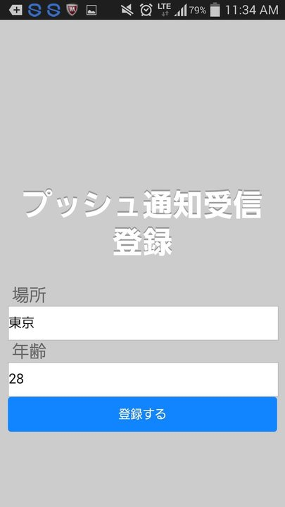

、# Monaca x NIFTYCLOUD mobile backend プッシュ通知サンプル

===

# Overview

こちらはMonacaを利用して、mbaasサーバーデバイストークンを登録し、プッシュ通知機能を簡単に実装するサンプルです。
* Android, iOSアプリをHTML, JavaScriptで簡単に作れるツール[Monaca](https://ja.monaca.io/)
* アプリのサーバー機能を簡単に作れるツール[Nifty cloud mobile backend](http://mb.cloud.nifty.com/) (以下からmBaaS)


## Demo

* mBaaSにてアプリ作成、プッシュ通知設定を行います。
* MonacaでgithubのURL(Download zip file)をインポートし、
アプリキーとクライントキーを設定し、アプリを起動（実機ビルド）します。
デバイストークンを登録し、管理画面からプッシュ配信を登録すると、プッシュが来たことを確認します。
※アプリからプッシュ通知登録は可能ですが、本サンプルに含まりません。

* トップ画面



* 登録成功画面


* 管理画面で野確認


## Description

* コードの説明

File: www/js/app.js

** 初期化設定
```JavaScript
var appKey    = "YOUR_APPKEY";
var clientKey = "YOUR_CLIENTKEY";
var senderId  = "YOUR_ANDROID_SENDERID";

///// Called when app launch
$(function() {
  NCMB.initialize(appKey, clientKey);
});
```

上記のコードでキーを指定し、NCMB.initialize(appKey, clientKey), mBaaSサーバーと連携を行います。
Android端末の場合、Android senderIDも追記してください。

* デバイストークン登録：

```JavaScript
document.addEventListener("deviceready", function()
{
  　・・・
    // デバイストークンを取得してinstallation登録が行われます
    // ※ aplication_key,client_keyはニフティクラウドmobile backendから発行されたkeyに置き換えてください
    // ※ sender_idは【GCMとの連携に必要な準備】で作成したProjectのProject Numberを入力してください
    window.NCMB.monaca.setDeviceToken(appKey, clientKey, senderId);
    // 開封通知登録の設定
    // trueを設定すると、開封通知を行う
    window.NCMB.monaca.setReceiptStatus(true);
},false);

```

* デバイストークンにカスタマイズ値を追加する場合
Exp: "Place", "Age"入力から登録を行います。

```JavaScript
function startInstallationRegistration() {
    // 登録されたinstallationのobjectIdを取得します。
    window.NCMB.monaca.getInstallationId(
        function(id) {
            var place = document.getElementById("place").value;
            var age = document.getElementById("age").value;
            //サーバーへの更新実施
            var InstallationCls = NCMB.Object.extend("installation");
            var installation = new InstallationCls();
            var query = new NCMB.Query(InstallationCls);
            query.get(id, {
                success: function(inst) {
                    ////端末のPlaceの値を設定
                    inst.set("Place", place);
                    ////端末のAgeの値を設定
                    inst.set("Age", age);
                    inst.save(null, {
                        success: function(obj) {
                          // 保存完了後に実行される
                          alert("プッシュ通知受信登録成功！");
                        },
                        error: function(obj, error) {
                          // エラー時に実行される
                          alert("登録失敗！次のエラー発生: " + error.message);
                        }
                    });
                },
                error: function(inst, error) {
                    alert("登録失敗！次のエラー発生: " + error.message);
                }
            });
        }
    );
}
```


## Requirement

* Monaca環境
* Nifty cloud mobile backend Javascript SDK version 1.2.6
ダウンロード：[Javascript SDK](http://mb.cloud.nifty.com/doc/current/introduction/sdkdownload_javascript.html)

## Installation

* Monacaで新規アプリ作成し、プロジェクトをインポートする。
  - monacaの利用登録する
    [Monaca](https://ja.monaca.io/)

  - monacaで新規プロジェクトを作成する


* Monacaでアプリ作成する: プロジェクトインポートを選択し、「URLを指定してインポートする」と選び、以下のURLからインポートする。
 https://github.com/ncmbadmin/monaca_push_template/archive/master.zip


* mobile backendでアプリ作成する
  - mobile backendで利用登録する
    [Nifty cloud mobile backend](http://mb.cloud.nifty.com/)


* プッシュ通知の設定を行います。
 - iOSの場合：[ドキュメント](http://mb.cloud.nifty.com/doc/current/tutorial/push_setup_ios.html)に参照してください
 - Androidの場合：[ドキュメント](http://mb.cloud.nifty.com/doc/current/tutorial/push_setup_android.html)に参照してください
   www/js/ncmb_push_start.jsにてsenderId設定を行います。

* monacaで作成したアプリをmobile backendサーバーと連携させる
  - monacaでアプリキー、クライアントキーを設定し、初期化を行う: www/js/ncmb_push_start.js

キーをコピーし、追記します。


* 動作確認
  - monacaで実機ビルドし、動作確認する

  - プッシュ通知を登録し、プッシュ通知が来ることを確認する


## Usage

サンプルコードをカスタマイズする、key, value変数を変更していただきます。
以下のドキュメントを参照し、データ保存・検索・プッシュ通知を入れることができる。
* [ドキュメント](http://mb.cloud.nifty.com/doc/current/)
* [ドキュメント・データストア](http://mb.cloud.nifty.com/doc/current/sdkguide/javascript/datastore.html)
* [ドキュメント・会員管理](http://mb.cloud.nifty.com/doc/current/sdkguide/javascript/user.html)
* [ドキュメント・プッシュ通知](http://mb.cloud.nifty.com/doc/current/sdkguide/javascript/push.html)


## Contributing

1. Fork it!
2. Create your feature branch: `git checkout -b my-new-feature`
3. Commit your changes: `git commit -am 'Add some feature'`
4. Push to the branch: `git push origin my-new-feature`
5. Submit a pull request :D

## License

* MITライセンス
* Nifty cloud mobile backendのJavascript SDKのライセンス
